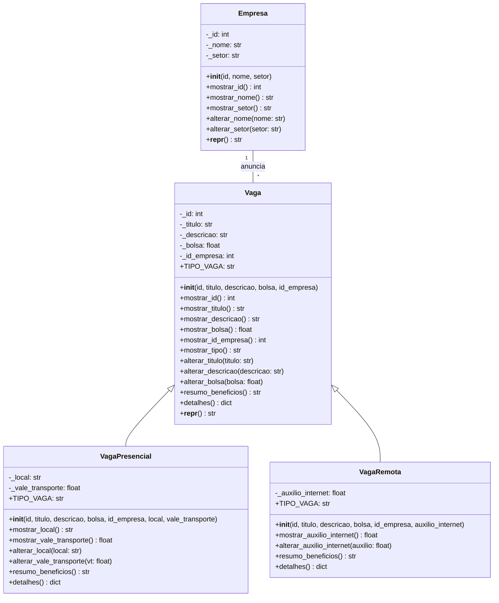

# Vagas de Estágio API

Este é o backend de um sistema para gerenciar vagas de estágio e empresas. O projeto segue a arquitetura em 4 camadas: `data`, `models`, `controllers` e `routes`.

## Como rodar

1. Instale as dependências:
   ```bash
   pip install -r requirements.txt
   ```
2. Inicie o servidor:
   ```bash
   uvicorn main:app --reload
   ```
3. Acesse a documentação interativa:
   [http://127.0.0.1:8000/docs](http://127.0.0.1:8000/docs)

## Diagrama de Classes



## Tabela de Rotas

| Verbo | Rota | Descrição |
|-------|------|-----------|
| GET | `/empresas/` | Lista todas as empresas |
| GET | `/empresas/{id}` | Busca uma empresa pelo ID (404 se não achar) |
| GET | `/vagas/` | Lista todas as vagas |
| GET | `/vagas/{id}` | Busca uma vaga pelo ID (404 se não achar) |
| GET | `/vagas/empresa/{id_empresa}` | Lista vagas de uma empresa específica |
| POST | `/vagas/` | Cria uma nova vaga (201 sucesso, 409 conflito, 422 erro de negócio) |

## Quem fez o quê

- **Aluno 1**: Estruturação do projeto
- **Aluno 2**: Models e `verificar.py`
- **Aluno 2**: Controladores, rotas FastAPI
- **Aluno 4**: `README.md` com diagrama

